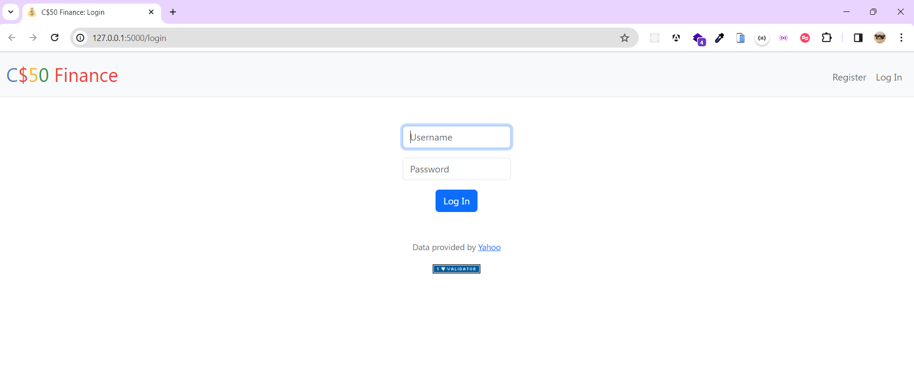
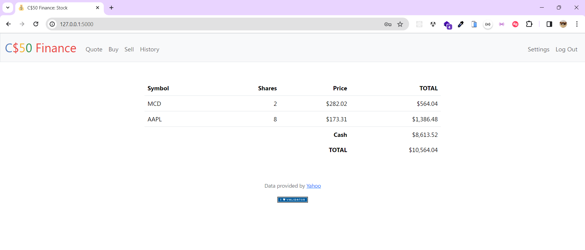
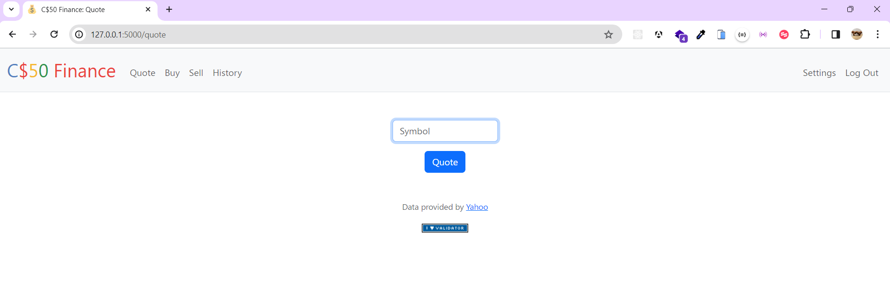
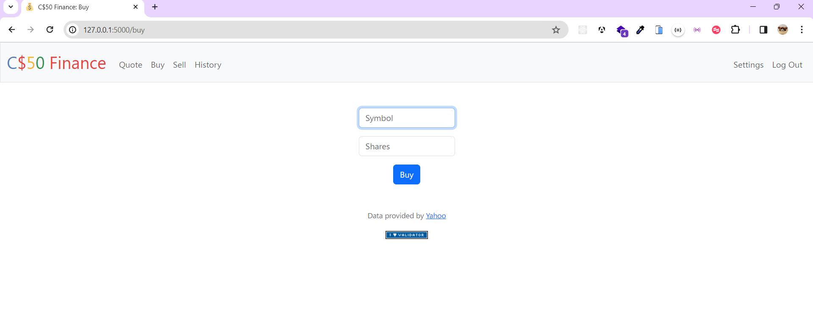
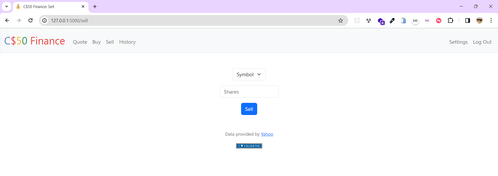
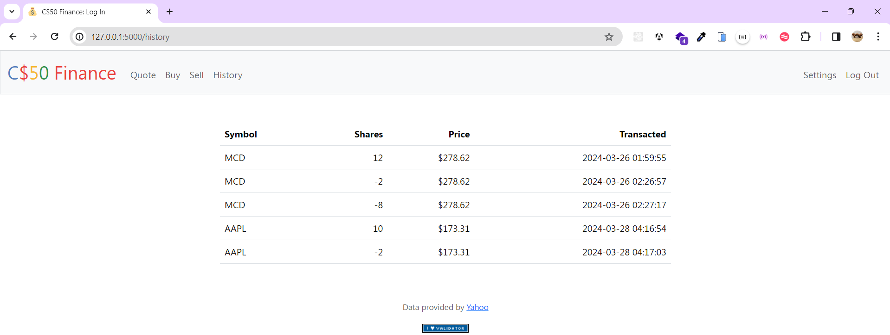
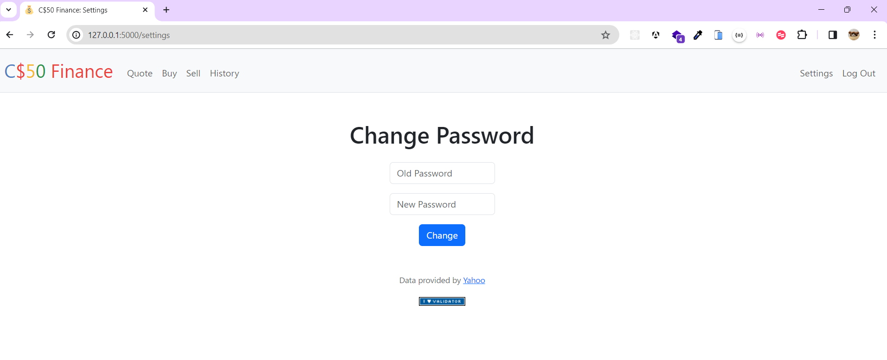
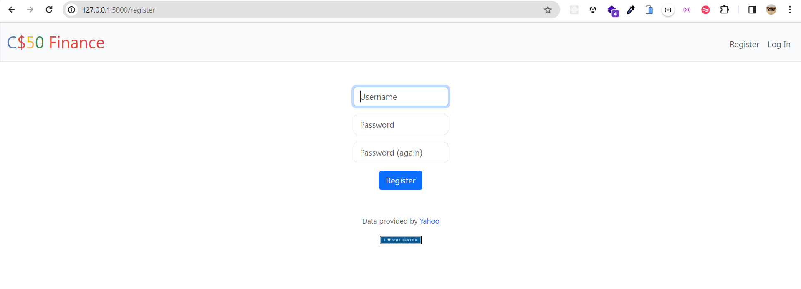

# CS50 Finance using Flask

Running flask 
- create a Python virtual environment;
```bash
python -m venv [directory]
```
- running virtual environment
```bash
.\venv\Scripts\activate
```

- install the requirements in virtual environment;
```bash
pip install -r requirements.txt
```

- database initializing;
```bash
python create_table.py
```

- install the requirements in virtual environment;
```bash
pip install -r requirements.txt
```

- running flask
```bash
flask run
```
# images

<figure>
  
  <figcaption>Login Form</figcaption>
</figure>

<hr>

<figure>
  
  <figcaption>Home</figcaption>
</figure>

<hr>

<figure>
  
  <figcaption>Quote</figcaption>
</figure>

<hr>

<figure>
  
  <figcaption>Buy</figcaption>
</figure>

<hr>

<figure>
  
  <figcaption>Sell</figcaption>
</figure>

<hr>

<figure>
  
  <figcaption>History</figcaption>
</figure>

<hr>

<figure>
  
  <figcaption>Change Password</figcaption>
</figure>

<hr>

<figure>
  
  <figcaption>Register</figcaption>
</figure>
